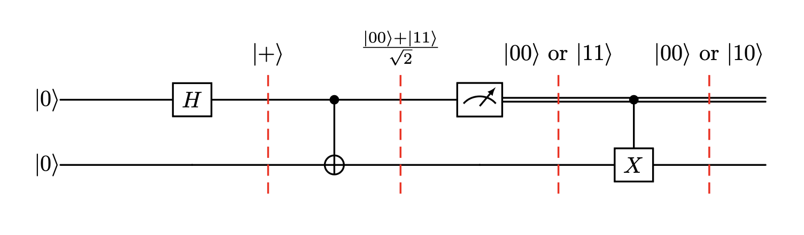

# Getting Started


## Installation

Guppy is installed as the [guppylang](https://pypi.org/project/guppylang/) Python package.

```shell
pip install guppylang
```

Guppy can be used with Python versions 3.10, 3.11, 3.12 and 3.13. The MacOS, Linux and Windows operating systems are supported.

The source code for Guppy can be found in a public repository on [GitHub](https://github.com/quantinuum/guppylang). If you have a feature request or think you have found a bug, feel free to raise a [GitHub issue](https://github.com/quantinuum/guppylang/issues).

Guppy programs can be executed on the [Selene](https://github.com/quantinuum/selene) emulator. As of the v0.21 release, Selene is now included with `guppylang` and powers the [guppylang.emulator](../sphinx/api/emulator.md) module under the hood.

## Example: A simple circuit

As a first example, let's write a Guppy program to implement a simple quantum circuit.
This circuit is deliberately designed to involve some classical control based on measurement outcomes:


You can see the intermediate states of the qubits as the circuit progresses annotated on the dashed lines.
Try to reason along!
Using Guppy, the prediction of the resulting state / measurement outcomes can be numerically supported using an emulator.

To implement this circuit, we define a Python function with the [`@guppy`](https://docs.quantinuum.com/guppy/api/decorator.html) decorator.
Since our circuit takes no inputs, the function does not have to have any parameters.
Similarly, as the circuit prepares a single-qubit state, we must annotate the function with the corresponding return type.
We also record the outcome of the mid-circuit measurement for later evaluation using `result`, as this will make it available later once we run the simulation.

```{code-cell} ipython3
from guppylang import guppy
from guppylang.std.builtins import result
from guppylang.std.quantum import cx, h, measure, qubit, x


@guppy
def simple_circuit() -> qubit:
    q1, q2 = qubit(), qubit()

    h(q1)
    cx(q1, q2)

    outcome = measure(q1)
    result("q1", outcome)

    if outcome:
        x(q2)

    return q2
simple_circuit.check()
```

For execution, we can write a function that invokes the circuit and consumes the produced qubit via a measurement.
The outcome is recorded for later evaluation as well.

```{code-cell} ipython3
@guppy
def evaluate() -> None:
    q = simple_circuit()
    result("q2", measure(q))
```

Finally, we can emulate our circuit implementation using the stabilizer simulator. 
Our program is executed for a single shot using the `run` method.

```{code-cell} ipython3
emulator = evaluate.emulator(n_qubits=2).stabilizer_sim().with_seed(3)
sim_result = emulator.run()
list(sim_result.results)
```

However, this is only a single shot.
We can produce larger numbers of shots using the same API by changing the configuration of the emulator.
Let's do this and plot the results using `matplotlib`:
```{code-cell} ipython3
import matplotlib.pyplot as plt
import numpy as np

shots = evaluate.emulator(n_qubits=2).with_seed(0).with_shots(10000).run()

fig, ax = plt.subplots(1, 1)
possible_outcomes = ["00", "01", "10", "11"]
idx = np.asarray(list(range(len(possible_outcomes))))

ax.bar(idx, [len([1 for shot in shots if str(shot.as_dict()['q1']) + str(shot.as_dict()['q2']) == o]) for o in possible_outcomes])

ax.set_title("Circuit simulation")
ax.set_xlabel("Measurement outcomes")
ax.set_xticks(idx)
ax.set_xticklabels(possible_outcomes)
ax.set_ylabel("Frequency")
plt.show()
```
The results roughly match the expected distribution that was predicted in the circuit.

That's it, you executed your first Guppy program successfully!
To see more examples of Guppy programs, take a look at the [Examples Gallery](examples_index.md).
